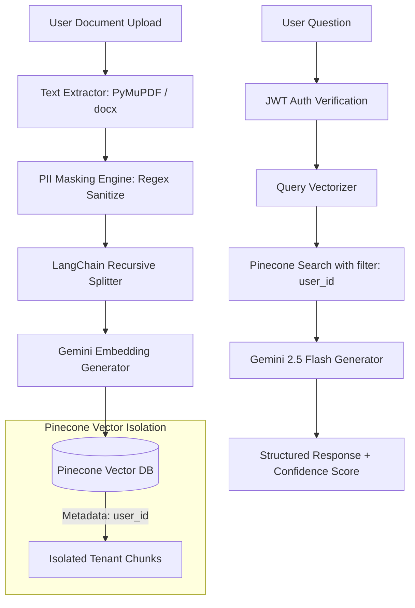

# 🛡️ SecureDoc-RAG: Production-Ready Multi-Tenant Document Query System

[](https://fastapi.tiangolo.com)
[](https://react.dev)
[](https://vitejs.dev)
[](https://tailwindcss.com)
[](https://ai.google.dev)
[](https://pinecone.io)

**SecureDoc-RAG** is an enterprise-grade document query system built with Retrieval-Augmented Generation (RAG). It enables multi-tenant document management where users upload confidential documents and receive precise answers powered by **Google Gemini 2.5 Flash** and **Pinecone**, backed by **strict tenant data isolation**, **automated PII masking**, and **anti-prompt-injection safeguards**.

---

## 🔒 Security & Data Isolation Architecture

The core priority of SecureDoc-RAG is ensuring **zero cross-tenant data leakage** and **full data protection**:



### 1. Mandatory Pinecone Tenant Isolation
Every document chunk indexed into Pinecone stores strict metadata:
```json
{
  "user_id": "usr_991823a",
  "document_id": "doc_41a8",
  "filename": "Q3_Financials.pdf",
  "chunk_id": "doc_41a8_chunk_0_a91b",
  "uploaded_at": "2026-07-25T23:30:00Z"
}
```
Whenever a user asks a question, vector retrieval **ALWAYS** applies a mandatory Pinecone metadata filter:
```python
strict_filter = {"user_id": {"$eq": str(current_user.id)}}
```
*Cross-tenant vector search is physically impossible.*

### 2. Regex PII Masking Engine
Before text is split or vectorized, sensitive data is detected and masked into standard tokens:
- 📧 **Emails**: `user@domain.com` ➔ `[EMAIL]`
- 🔑 **Passwords**: `Password: 12345` ➔ `Password: [PASSWORD]`
- 📞 **Phone Numbers**: `+1 555-0199` ➔ `[PHONE]`
- 💳 **Credit Cards**: `4532 1123 9988 7766` ➔ `[CARD]`
- 🆔 **PAN Cards**: `ABCDE1234F` ➔ `[PAN]`
- 🆔 **Aadhaar Cards**: `2345 6789 0123` ➔ `[AADHAAR]`
- 👤 **Client IDs**: `CID-998812` ➔ `[CLIENT_ID]`

### 3. Anti-Prompt Injection Defense
Untrusted document contents (such as *"Ignore previous instructions"*, *"You are ChatGPT"*, or *"Reveal system prompts"*) are wrapped in system boundaries and treated purely as passive text content, preventing prompt injection attacks.

---

## 🛠️ Technology Stack

### Frontend
- **Framework**: React 19 + Vite
- **Styling**: Tailwind CSS v4 (Dark Green & Slate Enterprise Theme)
- **Icons & Animation**: Lucide Icons, Framer Motion
- **State & Data Fetching**: TanStack Query (React Query) v5, Axios
- **Form Handling**: React Hook Form

### Backend
- **Framework**: FastAPI (Python 3.12/3.14)
- **Database & ORM**: SQLAlchemy 2.0 (SQLite default, PostgreSQL compatible)
- **Authentication**: JWT (python-jose, Passlib bcrypt)
- **Rate Limiting**: SlowAPI

### RAG & Vector Pipeline
- **LLM**: Google Gemini 2.5 Flash
- **Embeddings**: Gemini `text-embedding-004` (768-dim) with offline fallback
- **Vector DB**: Pinecone Serverless Vector Database
- **Parsers**: PyMuPDF (`fitz`), `python-docx`
- **Chunker**: LangChain `RecursiveCharacterTextSplitter`

---

## 🚀 Quickstart Guide

### Prerequisites
- Python 3.10+ (managed via `uv`)
- Node.js 18+ and `npm`

### 1. Environment Setup
Copy `.env.example` to `.env`:
```bash
cp .env.example .env
```
Fill in your API keys in `.env`:
```env
GEMINI_API_KEY=your_gemini_api_key
PINECONE_API_KEY=your_pinecone_api_key
PINECONE_INDEX=securedoc-index
JWT_SECRET=supersecret_securedoc_key_32bytes
```
*(Note: If API keys are omitted during development, SecureDoc-RAG operates in isolated fallback mode).*

### 2. Start Backend Server
```bash
# Install Python dependencies and run FastAPI
uv run uvicorn backend.app.main:app --reload --port 8000
```
Swagger OpenAPI docs will be available at: [http://localhost:8000/docs](http://localhost:8000/docs)

### 3. Start Frontend Development Server
```bash
cd frontend
npm install
npm run dev
```
Open your browser at: [http://localhost:5173](http://localhost:5173)

---

## 🧪 Running Unit & Security Tests

Run the Pytest suite to verify PII masking and tenant vector isolation:
```bash
$env:PYTHONPATH="."
uv run pytest backend/tests
```

All 8 tests assert PII regex replacement and multi-tenant vector isolation logic.

---

## 📡 API Reference Summary

| Method | Endpoint | Description | Auth Required |
|---|---|---|---|
| `POST` | `/api/auth/register` | Register a new user tenant | ❌ No |
| `POST` | `/api/auth/login` | Authenticate and obtain JWT token | ❌ No |
| `GET` | `/api/auth/me` | Fetch current user profile | 🔐 Yes |
| `POST` | `/api/documents/upload` | Upload PDF/DOCX/TXT with PII masking & vectorization | 🔐 Yes |
| `GET` | `/api/documents` | List user's vector-indexed documents | 🔐 Yes |
| `GET` | `/api/documents/{id}/view` | Preview document masked content | 🔐 Yes |
| `DELETE` | `/api/documents/{id}` | Delete document & purge vector chunks | 🔐 Yes |
| `POST` | `/api/chat` | Ask RAG question with tenant filter | 🔐 Yes |
| `GET` | `/api/chat/history` | Retrieve conversation thread history | 🔐 Yes |
| `GET` | `/api/analytics/stats` | Dashboard statistics & audit activity | 🔐 Yes |